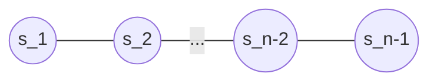

$\global\def\angl#1{{\left\langle #1 \right\rangle}}$

# Coxeter Groups and the Hecke Algebra

[Introduction]
(Put something about the motivation?)

> **Definition**
> A Coxeter system $(W,S)$ is a group $W$ with a finite set of generators $S = \{s_1, ..., s_n\}\subset W$ such that for $s,t \in S$, $(st)^{m_{st}} = 1$ where $m_{ss} = 1$ and $m_{st} = m_{ts} \in \{2,3,...\} \cup \{\infty\}$ if $s \neq t$. In other words $W$ has a presentation
> $$W = \angl{s \in S \mathrel{|} (st)^{m_{st}} = 1, \text{ for all } s,t \in S \text{ where } m_{st} < \infty}.$$
>
> A Coxeter group is a group for which there exists a Coxeter system.

>>>>> **Q: Which way should i define this? Coxeter Systems -> Coxeter Groups, or vice versa?**
>>>>> **Q: Should I explain differences between Coxeter groups and systems? (Will need some sort of motivation for the choice of study, and justification of some statements (ie. statements in Remark 1.2 of textbook)**

We allow the value $m_{st} = \infty$ to mean there is no relation between $s,t \in S$ of the form $(st)^m$ with $m \in \Z_{> 0}$. 

These relations inside a Coxeter group can be written in a different way.
- When $s = t$, we obtain relations of the form $s^2 = 1$ which we call *quadratic relations*.
- Otherwise when $s \neq t$ and $m_{st} < \infty$, the relation $(st)^{m_{st}} = 1$ can be rewritten as
$$\underbrace{sts...}_{m_{st}} = \underbrace{tst...}_{m_{st}}$$
which we call *braid relations*.

## Example
One example we will frequently refer to and build on is the Coxeter system of type $A_{n-1}$, for $n \geq 2$.

> **Definition**
> For $n \geq 2$, the Coxeter system of type $A_{n-1}$ is given by the generating set $S = \{s_1, s_2, ..., s_{n-1}\}$ under the relations
> - $s_i^2 = 1$
> - $s_i s_{i+1} s_i = s_{i+1} s_i s_{i+1}$
> - $s_i s_j = s_j s_i$ if $|i - j| > 1$

We can alternatively represent the relations in this system with the following Coxeter diagram (or graph).

Here, the vertices represent each generator, no edge between $s$ and $t$ means that $m_{st} = 2$, an unlabelled edge between $s$ and $t$ means that $m_{st} = 3$, and if $m_{st} \geq 3$ the edge will be labelled with this value.

> Do we even need this? Maybe helpful to understand the relations a bit better

The Coxter group for this system is isomorphic to the symmetric group $S_n$, where $s_i$ corresponds to the transposition $(i, i+1)$, written in cycle notation. Indeed these transpositions generate $S_n$ and we can easily check that these satisfy the relations for $A_{n-1}$.

An easy case is the Coxeter system of type $A_2$ (isomoprhic to $S_3$) which is generated by two elements $s,t$, and which correspond to the transpositions $(12),(23)$ respectively. Using the relations for this Coxeter system, we can write down all the elements of its Coxeter group.
- Initially we have $1,s,t$ where $1$ denotes the neutral element.
- Since $s_i^2 = 1$, we can only generate elements by multiplying $s$ and $t$ in an alternating fashion. We can ignore the third relation here because we only have 2 generators. Then we additionally get the elements $s, st, sts, stst, ...$ and $t, ts, tst, tsts, ...$.
- The braid relation tells us that $sts = tst$, which allows us to reduce larger products to products of at most 3 generators. For example $stststs = tsttsts = tssts = tts = s$.
- The Coxter system has no other relations so we cannot simply futher. Therefore our elements are $1,s,t,st,ts,sts$.
  - Notice that these are all the elements of $S_3$ if we replace $s,t$ with their corresponding transpositions.

