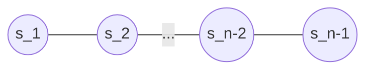

$\global\def\angl#1{{\left\langle #1 \right\rangle}}$

# Coxeter Systems and the Hecke Algebra

## Coxeter Systems
[Introduction]
(Put something about the motivation?)

> **Definition**
> A Coxeter system $(W,S)$ is a group $W$ with a finite set of generators $S = \{s_1, ..., s_n\}\subset W$ such that for $s,t \in S$, $(st)^{m_{st}} = 1$ where $m_{ss} = 1$ and $m_{st} = m_{ts} \in \{2,3,...\} \cup \{\infty\}$ if $s \neq t$. In other words $W$ has a presentation
> $$W = \angl{s \in S \mathrel{|} (st)^{m_{st}} = 1, \text{ for all } s,t \in S \text{ where } m_{st} < \infty}.$$
>
> A Coxeter group is a group for which there exists a Coxeter system.

>>>>> **Q: Which way should i define this? Coxeter Systems -> Coxeter Groups, or vice versa?**
>>>>> **Q: Should I explain differences between Coxeter groups and systems? (Will need some sort of motivation for the choice of study, and justification of some statements (ie. statements in Remark 1.2 of textbook)**

We allow the value $m_{st} = \infty$ to mean there is no relation between $s,t \in S$ of the form $(st)^m$ with $m \in \Z_{> 0}$. 

These relations inside a Coxeter group can be written in a different way.
- When $s = t$, we obtain relations of the form $s^2 = 1$ which we call *quadratic relations*.
- Otherwise when $s \neq t$ and $m_{st} < \infty$, the relation $(st)^{m_{st}} = 1$ can be rewritten as
$$\underbrace{sts...}_{m_{st}} = \underbrace{tst...}_{m_{st}}$$
which we call *braid relations*.

Coxeter systems are closely related to reflections, so we often call elements of $S$ *simple reflections*, and elements in $W$ that are conjugates to elements in S *reflections*.

[add some references about reflections - ch2, or if it gets included in this paper]

### Notation
Let $w \in W$. As $S$ generates $W$, we can write $w = s_1 s_2 ... s_k$ for some $s_1,...,s_k \in S$. We call the sequence $(s_1, ..., s_k)$ an *expression for $w$* of *length $k$*. Given the relations in the definition, $w \in W$ is not uniquely expressed as a sequence, so we write $\underline{w}$ to specify both the element $w \in W$ and the particular expression $(s_1, ..., s_k)$ for $w$.

### Example
One example we will frequently refer to and build on is the Coxeter system of type $A_{n-1}$, for $n \geq 2$.

> **Definition**
> For $n \geq 2$, the Coxeter system of type $A_{n-1}$ is given by the generating set $S = \{s_1, s_2, ..., s_{n-1}\}$ under the relations
> - $s_i^2 = 1$
> - $s_i s_{i+1} s_i = s_{i+1} s_i s_{i+1}$
> - $s_i s_j = s_j s_i$ if $|i - j| > 1$

We can alternatively represent the relations in this system with the following Coxeter diagram (or graph).

Here, the vertices represent each generator, no edge between $s$ and $t$ means that $m_{st} = 2$, an unlabelled edge between $s$ and $t$ means that $m_{st} = 3$, and if $m_{st} \geq 3$ the edge will be labelled with this value.

> Do we even need this? Maybe helpful to understand the relations a bit better

The Coxter group for this system is isomorphic to the symmetric group $S_n$, where $s_i$ corresponds to the transposition $(i, i+1)$, written in cycle notation. Indeed these transpositions generate $S_n$ and we can easily check that these satisfy the relations for $A_{n-1}$.

An easy case is the Coxeter system of type $A_2$ (isomoprhic to $S_3$) which is generated by two elements $s,t$, and which correspond to the transpositions $(12),(23)$ respectively. Using the relations for this Coxeter system, we can write down all the elements of its Coxeter group.
- Initially we have $1,s,t$ where $1$ denotes the neutral element.
- Since $s_i^2 = 1$, we can only generate elements by multiplying $s$ and $t$ in an alternating fashion. We can ignore the third relation here because we only have 2 generators. Then we additionally get the elements $s, st, sts, stst, ...$ and $t, ts, tst, tsts, ...$.
- The braid relation tells us that $sts = tst$, which allows us to reduce larger products to products of at most 3 generators. For example $stststs = tsttsts = tssts = tts = s$.
- The Coxter system has no other relations so we cannot simply futher. Therefore our elements are $1,s,t,st,ts,sts$.
  - Notice that these are all the elements of $S_3$ if we replace $s,t$ with their corresponding transpositions.

>> Any other examples we should add?

### Geometric Representation

> Do we need the converse? (That any finite subgroup of $O(\R^n)$ generated by reflections admits a Coxeter presentation [see 1.1.6])

> **Definition**
> Given a Coxeter system $(W,S)$ we define the representation $V$ of $W$ as follows. Let $V$ be a real vector space with basis elements $\{\alpha_s : s \in S\}$. Let $(-,-)$ be a symmetric bilinear form on $V$ defined by
> $$(\alpha_s, \alpha_t) = -\cos \frac{\pi}{m_{st}}.$$
> When $m_{st} = \infty$, we use the convention that $\pi/m_{st} = 0$. Furthermore, we define a $W$-action on $V$ such that for $s \in S$ and $v \in V$,
> $$s(v) = v - 2(v,\alpha_s)\alpha_s.$$
> That is an $s$-action is the reflection along the hyperplane orthogonal to $\alpha_s$ in $V$.
> 
> We call this representation the geometric representation of the Coxeter system.

Note that this is defined for both finite and infinite Coxeter groups.

> Do we need to mention the positive definiteness of the bilinear form? [see thm 1.3.4]

> **Proposition**
> For any Coxeter system, the geometric representation is faithful.
> [see prop 1.28]

### Properties
(TODO: Add more properties and definitions)

> **Definition**
> Let $w \in W$. For any expression $\underline{w} = (s_1, ..., s_k)$, the length $\ell(\underline{w})$ of $\underline{w}$ is $k$. The length of $w$, written $\ell(w)$ is the minimal $k$ such that $w$ admits an expression of length $k$. If an expression for $w$ has length $\ell(w)$ we call it a reduced expression.

Note that $\ell(w) = 0$ if and only if $w = 1$ (the identity).

> **Theorem** (Exchange condition)
> Let $\underline{w} = (s_1, ..., s_k)$ be a reduced expression for $w \in W$, and let $t \in S$. If $\ell(wt) < \ell(w)$, then there exists an integer $i$ such that $1 \leq i \leq k$ and $wt = s_1 ... \hat{s_i} ... s_k$, i.e. the $i$-th element of the expression for $w$ is removed.

(TODO: Example?)

> **Corollary** (Deletion Condition)
> Let $\underline{w} = (s_1, ..., s_k)$ be an expression for $w \in W$ where $\ell(w) < k$ (i.e. not of minimal length). Then there exists $i < j$ such that $w = s_1 ... \hat{s_i} ... \hat{s_j} ... s_k$.

In other words, if an expression is not of minimal length, two elements in the expression may be cancelled to result in a shorter expression.

> **Theorem** (Matsumoto)
> Any two reduced expressions for $w \in W$ are related by braid relations.

(TODO: Put a proof, or where to find one)

### Bruhat order
(TODO: Something about what this is used for)

> **Definition** (Bruhat order)
> Let $T$ be the set of reflections in $W$, i.e. the set of elements of $W$ conjugate to elements of $S$. For $x,y \in W$, write $x \to y$ if $\ell(x) < \ell(y)$ and $xt = y$ for some $t \in T$. The Bruhat graph is the directed graph with vertices as the elements of $W$ and arrows as in the relation $\to$. The Bruhat order on $W$ is the partial order $\leq$ given by the transitive closure of the relation $\to$.

In other words, $x \leq y$ if and only if we can draw a path from $x$ to $y$ following the arrows on the Bruhat graph (i.e. a directed path from $x$ to $y$).

(TODO: Examples)

## Hecke Algebra

Fix a Coxeter system $(W,S)$. Write $\Z[v,v^{-1}]$ for the Laurent polynomial ring, i.e. the integer ring adjoined with $v$ (indeterminate over $\Z$) and its inverse.

> **Definition**
> The Hecke Algebra $\mathrm{H}$ or $\mathrm{H}(W)$ is the unital associative algebra over $\Z[v,v^{-1}]$ generated by $\{\delta_s : s \in S\}$ under the following relations.
> - (Quadratic relation) For all $s \in S$,
>   - $\delta_s^2 = (v^{-1} - v)\delta_s + 1$
> - (Braid relation) For all $s,t \in S$ with $m_{st} < \infty$,
>   - $\underbrace{\delta_s \delta_t \delta_s ...}_{m_{st}} = \underbrace{\delta_t \delta_s \delta_t ...}_{m_{st}}$.

- Recall that an algebra over a commutative ring $R$ is an $R$-module with an $R$-bilinear multiplication operation. A unital associative algebra over $R$ is then an algebra over $R$ for which multiplication is associative and has a multiplicative identity.
- (TODO: Mention why the quadratic relation is the way it is)
- Note that the quadratic relation is equivalent to $(\delta_s - v^{-1})(\delta_s + v) = 0$.

> (Stuff about how it relates to the Coxeter group)

Let $A$ be a commutative ring, then a ring homomorphism $\phi: \Z[v ,v^{-1}] \to A$ gives $A$ the structure of a $\Z[v,v^{-1}]$-algebra ([Check] so that the action of $x \in \Z[v,v^{-1}]$ on $a \in A$ is $x \cdot a = \phi(x) a$??). With this we can form the specialisation $\mathrm{H}_\phi := A \otimes_{\Z[v,v^{-1}]} \mathrm{H}$ of $\mathrm{H}$. (Look more into what specialisation is.) Note that this specialisation is uniquely determined by the ring $A$ and the invertible element $\phi(v) \in A^\times$.

Particularly, in the case where $A = \Z$ and $\phi(v) = 1$, the specialisation of $\mathrm{H}$ is isomorphic to the group algebra $\Z[W]$ (mapping $\delta_s$ to $s \in S$). Because of this, the Hecke algebra is often called a deformation of the group algebra of $W$.
- Further note in the specialisation $v \mapsto 1$, the quadratic relation of the Hecke algebra retrieves the quadratic relation of Coxeter groups
- (TODO: What this says about the hecke algebra)

### Standard Basis
Given $x \in W$, choose a reduced expression $\underline{x} = (s_1, s_2, ..., s_m)$ and we can define the element $\delta_s := \delta_{s_1} \delta_{s_2} ... \delta_{s_m}$ of $\mathrm{H}$.

